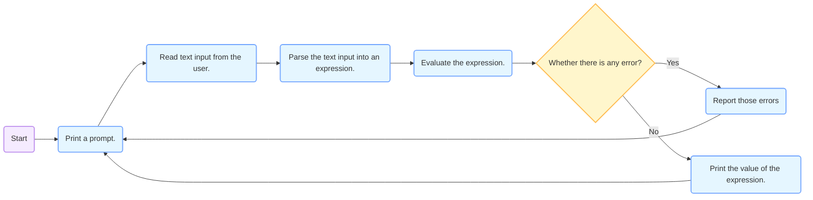

_**A programming language that behaves like a calculator that we create.**_
# The Pair Class
The pair class represents Scheme pairs and lists.  
A list is a pair whose second element is either a list or nil.

```python
class Pair:
	def __init__(self, first, second):
		self.first = first
		self.second = second # Second is either a well-formed list or nil for a Pair to be a well-formed list.
```

[Scheme expression are represented as Scheme lists!](Programs_as_Data.md)(Data representation equals to the source code representation: <font color="Yellow">Homoiconic</font>)

# Syntax
The calculator language has primitive expressions and call expressions.  
These two things are like these two things in Scheme.


# Semantics
The value of a calculator expression is defined recursively.
- Primitive: A number evaluates to itself.
- Call: A call expression evaluates to its argument values(operands which is evaluated by another recursive call) combined by an operator.
	- +: Sum of the arguments  
	- *: Product of the arguments  
	- -: If one argument, negate it. If more than one, subtract the rest from the first.  
	- /: If one argument, invert it. If more than one, divide the rest from the first.

# Evaluation
## The `eval` Function
_**The `eval` function computes the value of an expression represented as a Scheme list, which is always a number.**_

It is a [generic function](Representation#^59svd7.md) that dispatches on the type of the expression (primitive or call).


## Applying Built-in Operator
The `apply` function applies some operation to a (Scheme) list of argument values.  
In calculator language, all operations are named by built-in operators: +, -, *, /


```python
def calc_apply(operator, args):
    """Apply the named operator to a list of args.
    >>> calc_apply('+', as_scheme_list(1, 2, 3))
    6
    >>> calc_apply('-', as_scheme_list(10, 1, 2, 3))
    4
    >>> calc_apply('-', as_scheme_list(10))
    -10
    >>> calc_apply('*', nil)
    1
    >>> calc_apply('*', as_scheme_list(1, 2, 3, 4, 5))
    120
    >>> calc_apply('/', as_scheme_list(40, 5))
    8.0
    >>> calc_apply('/', as_scheme_list(10))
    0.1
    """
    if not isinstance(operator, str):
        raise TypeError(str(operator) +'is not a symbol')
    if operator == '+':
        return reduce(add, args, 0)
    elif operator == '-':
        if len(args) == 0:
            raise TypeError(operator +'requires at least 1 argument')
        elif len(args) == 1:
            return -args.first
        else:
            return reduce(sub, args.second, args.first)
    elif operator == '*':
        return reduce(mul, args, 1)
    elif operator == '/':
        if len(args) == 0:
            raise TypeError(operator +'requires at least 1 argument')
        elif len(args) == 1:
            return 1/args.first
        else:
            return reduce(truediv, args.second, args.first)
    else:
        raise TypeError(operator +'is an unknown operator')
```

# Interactive Interpreter
_**The user interface for many programming language is an interactive interpreter.**_
## Read-Eval-Print Loop


```python
def read_eval_print_loop():
    """Run a read-eval-print loop for Calculator."""
    while True:
        try:
            src = buffer_input()
            while src.more_on_line:
                expression = scheme_read(src)
                print(calc_eval(expression))
        except (SyntaxError, TypeError, ValueError, ZeroDivisionError) as err:
            print(type(err).__name__ + ':', err)
        except (KeyboardInterrupt, EOFError):  # <Control>-D, etc.
            print('Calculation completed.')
            return
```

# Raising Exceptions
_**Exceptions are raised within lexical analysis, syntactic analysis, eval, and apply.**_

# Handling Exceptions
_**An interactive interpreter should print information about each error.**_

A well-designed interactive interpreter should not halt completely on an error, so that the user has an opportunity to try again in the current environment.

How to accomplish this:  
Put both parsing and evaluation within a try statement.  
And put all of these within a while statement to go back and try again.
