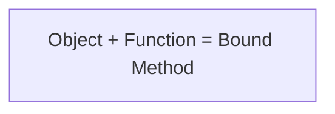
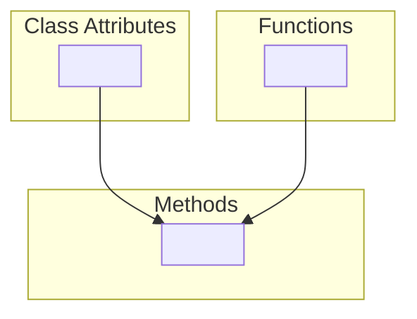

# Definition
- A [class](#Class.md) combines (and abstract) data and functions. _(Blueprint)_
- An [object](#Object.md) is an instantiation of a class.
- All classes and instances have some [attributes](#Attribute.md).
- OOP is:  
	- a method for organizing modular programs.  
		- [Abstraction barrier](Data_Abstraction.md)
		- [Bundling together information(data) and related behavior(function)](#Object.md)
    - A metaphor for computation using distribute state.
		- Each object has its own state.
		- Each object also knows how to manage its own local state, based on method calls.
		- [Method](#Methods.md) calls are messages passed between objects.
		- Several objects may all be instances of a common type.
		- Different types may relate to each other.
    - Special syntax and vocabulary that can improve the composition of programs
E.g.
- `String` is a built-in class, `append` is a function.
- `Int` is a built-in class, `add` is a function, too.

That is say: We store information as data and we can manipulate data through those function.

_**We can define our own class.**_  

# Class
_**A class serves as a template for its instances, each object is an instance of some class.**_

classes are _**first-class values**_ in Python

It adhere DRY principle:  
Same data structure and behavior to all the instances.
## Class Statement
```python
class <name>:
	<suite> # It is executed when the class is executed
```

A class statement creates a new class and binds that class to `<name>` in the first frame of the current environment.(It can also bind other name with assignment statement)  
Assignment and `def` statement in `<suite>` create attributes of the class(not names in frames)

## Object 
_**An object is a value that behave like what it is supposed to represent.**_
- Objects represent information
- They consist of data and behavior, bundled together to create abstractions
- Objects can represent things, but also properties, interactions and processes
- In Python, _**every value**_ is an object
    - All objects have attributes
    - A lot of data manipulation happens through object methods
    - Functions do one thing; objects do many related things

### Construction
When a class is called:
1. A new instance of that class is created.
2. The `__init__` method of the class is called with the new object as its first argument (bound to self), along with any additional arguments provided in the call expression.
```python
class Account:  
	def __init__(self, account_holder):  
		self.balance = 0  
		self.holder = account_holder

a = Account("Jim")
# a is the first argument to __init__, self.
```
`__init__` is called a constructor, it will be executed automatically once we create a new object.  
It give an instance some attributes by attribute assignment.   
- constructor:
	- allocate memory for an object
	- initialize the object with values.
	- return address of the object
	- _similar to a [List](List.md)_


### Identity
_**Every object that is an instance of a user-defined class has a unique identity:**_
- Every call a class creates a new instance. There are only one class but lots of objects.
- Bind an object to a new name using assignment does not create a new object.

We can use [identity operators](Mutable_Variable.md#^ggr4iq.md) to test if two expression evaluate to same object.

## Methods
_**Methods are what represent message that an object will accept.**_
### Define
They are just functions and defined in the suite of a class statement.
```python
class Account:  
	def __init__(self, account_holder):  
		self.balance = 0  
		self.holder = account_holder
# balance and holder are instance's attribute
  

	def deposit(self, amount):  
		self.balance = self.balance + amount  
		return self.balance

  

	def withdraw(self, amount):  
		if amount > self.balance:  
			return 'Insufficient funds'  
		self.balance = self.balance - amount  
		return self.balance
# deposit and withdraw are class's attribute, all instance share the same methods.
```
These `def` statements create function objects as always, but their names are bound as attributes of the class instead of in a particular frame. 

### Invoking
All invoked methods have access to the object via the <font color="Blue">self</font> parameter, and so they can all access and manipulate the object's state.

```python
def deposit(self, amount):  
	self.balance = self.balance + amount  # Defined with two arguments
		return self.balance  


>>> tom_account = Account('Tom')  
>>> tom_account.deposit(100)  # Invoked with one argument
100 
```
_**Dot notation automatically supplies the first argument to a method.**_  

#### Dot Expressions
_**Objects receive messages via dot notation.**_  

Dot notation accesses attributes of the instance **or** its class.  
`<expression>. <name>`
- The `<expression>` can be any valid Python expression.
- The `<name>` must be a simple name.

[Evaluates to the value of the attribute](Expression.md) looked up by `<name>` in the object that is the value of the `<expression>`.

It is:
- `<expression> -> object`
- `<name> -> attribute`

## Attribute
_**Attributes are data that is stored within either an instance or the class itself.**_

The way to access them:
- [#Dot_Expressions](#Dot_Expressions.md)
- Some built-in functions

```python
>>> getattr(tom_account, 'balance')  
10  
>>> hasattr(tom_account, 'deposit')  
True
```
- Using `getattr()`, we can look up an attribute using a string  
- Using `hasattr()`, we can test if it has this attribute.

`getattr()` and dot expressions look up a name in the same way

Looking up an attribute name in an object may return:  
1. One of its instance attributes, **or**  
2. One of the attributes of its class
3. when it has a [base class](Inheritance.md#^cy20w2.md), looking up its base classes recursively.
(Looking up sequentially) ^ngtggr

### Attribute [Assignment](Names,_Assignment_and_User-Defined_Functions.md)
_**Attribute assignment statement change the value that are bound to attribute names within an object or a class.**_

Assignment statements with a dot expression on their left - hand side affect attributes for the object of that dot expression  
- If the object is an instance, then assignment sets an instance attribute  
- If the object is a class, then assignment sets a class attribute

  
```python
class Account:  
interest = 0.02  
def __init__(self, holder):  
self.holder = holder  
self.balance = 0  
...  


tom_account = Account('Tom')

```
- Instance Attribute Assignment:  
	`tom_account.interest = 0.08`  
	This expression evaluates to an object  
	Attribute assignment statement adds or modifies the attribute named “interest” of <font color="Blue">tom_account</font>  
	tom_account doesn't have an attribute named interest, so in this situation, we add one to it.  
	So the name ("interest") is not looked up, although there is an attribute named interest in the class, we won't assign to it.  
	Then when we look up for this attribute, the one in instance will be returned and will not changes in line with class's.([Remember order.](Object-Oriented_Programming(OOP).md#^ngtggr.md))

- Class Attribute Assignment:  
	`Account.interest = 0.04`  
	On the other hand, this will modify the class attribute, interest.

[Shared attribute name constitute interface](Representation.md)

## Methods and Functions
_**Method is an attribute that is a function.**_  

Python distinguishes between: 
- Functions, which we have been creating since the beginning of the course, and 
- **Bound methods**, which couple together a function and the object on which that method will be invoked. 




```python
>>> type(Account.deposit)
<class 'function'>
>>> type(tom_account.deposit) # The first parameter is already passed in.
<class'method'> 

>>> Account.deposit(tom_account, 1001) 
1011 
>>> tom_account.deposit(1000) 
2011
```

We should remember that the first argument `self` is already passed in.  
So when we assign to the bound-method we should make the new function _do not have a `self` argument_.


## Class Attributes
_**Class attributes are "shared" across all instances of a class and they are attributes of the class, not the instance.**_

```python
class Account:  
	interest = 0.02 # A class attribute  
	def __init__(self, account_holder):  
		self.balance = 0  
		self.holder = account_holder


>>> tom_account = Account('Tom')  
>>> jim_account = Account('Jim')  
>>> tom_account.interest  
0.02  
>>> jim_account.interest  
0.02
```
Interest is not part of the instance that was somehow copied from the class! Neither of them has its own interest.


# Conclusion

- All objects have attributes, which are name−value pairs  
- Classes are objects too, so they have attributes  
- Instance attribute: attribute of an instance  
- Class attribute: attribute of the class of an instance

Python object system:  
- Functions are objects.  
- Bound methods are also objects: a function that has its first parameter "self" already bound to an instance.  
- Dot expressions evaluate to bound methods for class attributes that are functions.  
`<instance>.<method name>`


